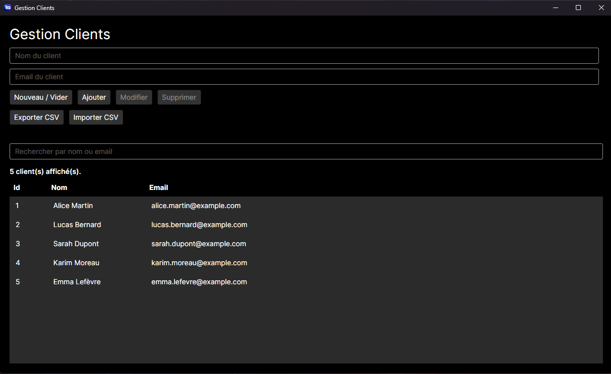
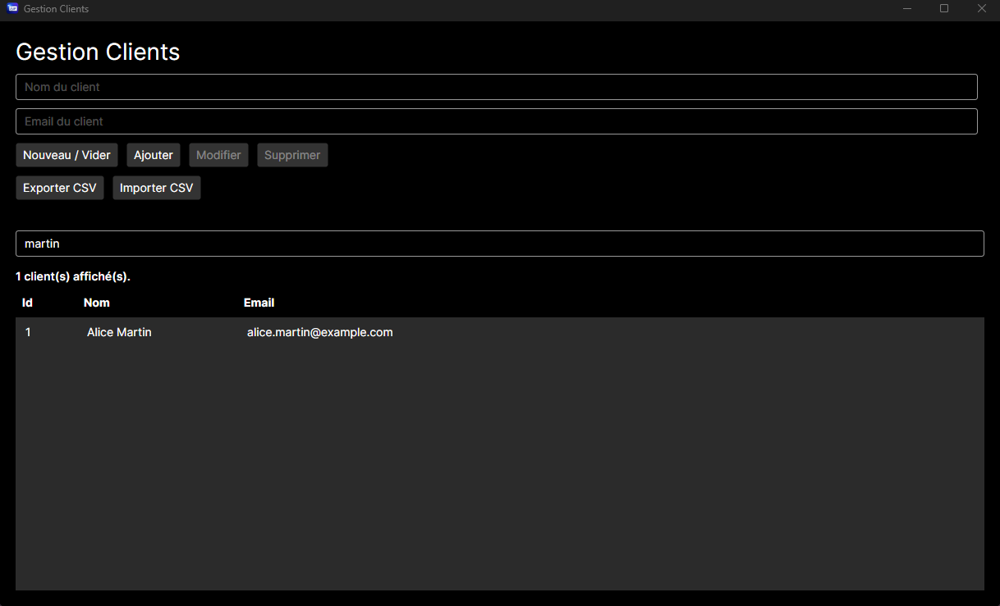
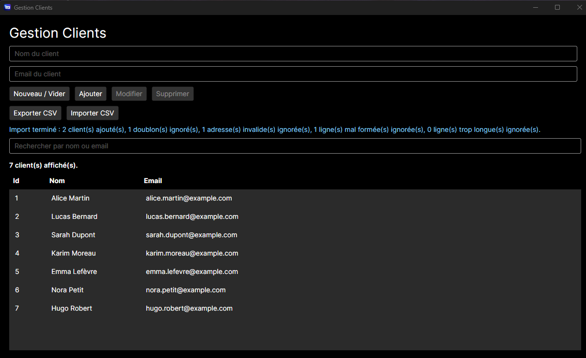
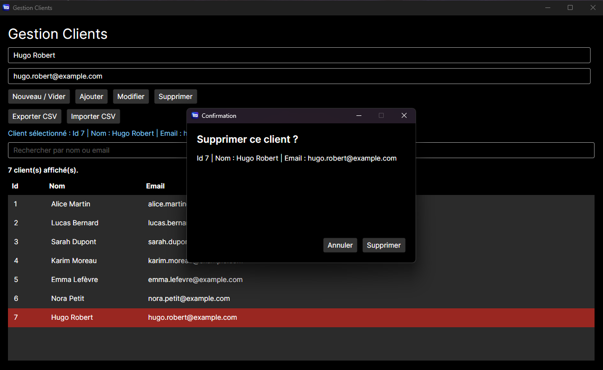

# Gestion Clients Avalonia

Application desktop développée en C# et .NET avec Avalonia UI, permettant de gérer localement une liste de clients à l’aide d’une base de données SQLite.

Le logiciel est pensé pour proposer une gestion simple, fiable et compréhensible des informations essentielles d’un client : son nom et son adresse email.


## Aperçu de l’application

### Vue principale

L’interface permet d’ajouter, modifier, supprimer, rechercher, importer et exporter des clients.



### Recherche dynamique

La liste est filtrée automatiquement pendant la saisie, sans distinction entre majuscules et minuscules.



### Import CSV avec validation

L’application importe les lignes valides et fournit un compte rendu détaillé des clients ajoutés, doublons, adresses invalides, lignes mal formées et champs trop longs.



### Confirmation de suppression

Une fenêtre de confirmation protège l’utilisateur contre les suppressions accidentelles.



## État du projet

Projet en cours de finalisation pour la version 1.0.0.

Le cœur fonctionnel de l’application est opérationnel. Une première publication Windows 64 bits autonome a été générée et validée sur un autre ordinateur ne disposant pas de l’environnement de développement.

L’identité visuelle de l’application est définie et intégrée à l’exécutable ainsi qu’aux différentes fenêtres.

Des captures d’écran représentatives des principales fonctionnalités ont également été préparées pour la présentation du projet.

Le travail restant porte principalement sur :

- la documentation d’installation et d’utilisation ;
- la préparation de l’archive Windows distribuable ;
- la création de la release GitHub `v1.0.0`.

## Fonctionnalités actuelles

### Gestion des clients

- Saisie du nom et de l’adresse email d’un client
- Validation des champs obligatoires
- Validation du format des adresses email
- Limitation du nom à 100 caractères
- Limitation de l’adresse email à 254 caractères
- Détection des adresses email déjà utilisées
- Enregistrement des clients dans une base de données SQLite
- Chargement automatique des clients au démarrage
- Affichage de l’identifiant, du nom et de l’adresse email
- En-têtes pour les colonnes Id, Nom et Email
- Affichage du nombre de clients actuellement visibles
- Sélection d’un client dans la liste
- Préremplissage du formulaire avec les données du client sélectionné
- Bouton Nouveau / Vider permettant de réinitialiser le formulaire
- Activation automatique des boutons Modifier et Supprimer selon la sélection
- Modification persistante d’un client
- Suppression persistante d’un client
- Fenêtre de confirmation avant la suppression
- Conservation des boutons de confirmation accessibles même lorsque les informations du client sont très longues

### Recherche

- Recherche dynamique des clients par nom ou adresse email
- Mise à jour automatique des résultats pendant la saisie
- Recherche sans distinction entre majuscules et minuscules
- Réaffichage automatique de tous les clients lorsque le champ de recherche est vidé
- Réapplication automatique de la recherche active après :
  - l’ajout d’un client ;
  - la modification d’un client ;
  - l’importation d’un fichier CSV.
- Conservation du filtre après les opérations qui actualisent la liste

### Import et export CSV

- Export de tous les clients au format CSV
- Export de l’ensemble de la base même lorsqu’une recherche est active
- Import de clients depuis un fichier CSV
- Détection obligatoire des colonnes `Nom` et `Email`
- Prise en charge des champs contenant des points-virgules et des guillemets
- Nettoyage des espaces inutiles autour du nom et de l’adresse email
- Validation des données pendant l’import
- Détection et exclusion des adresses email déjà présentes dans la base
- Détection des doublons présents dans un même fichier CSV
- Détection et comptage des lignes CSV mal formées
- Détection des adresses email invalides
- Détection des champs dépassant les longueurs autorisées
- Import des lignes valides même lorsque le fichier contient des lignes incorrectes
- Affichage d’un message spécifique lorsque le fichier ne contient aucun client à importer
- Ajout groupé des clients dans une transaction SQLite
- Annulation complète de la transaction en cas d’erreur technique
- Gestion des fichiers CSV verrouillés, inaccessibles ou illisibles
- Refus des retours à la ligne dans les champs exportés
- Compte rendu détaillé après l’import :
  - clients ajoutés ;
  - doublons ignorés ;
  - adresses email invalides ;
  - lignes mal formées ;
  - lignes contenant des champs trop longs.

## Fiabilité des données

- Base SQLite stockée dans le dossier local de l’utilisateur :

  `%LocalAppData%\GestionClientsAvalonia\GestionClient.db`

- Création automatique du dossier de l’application
- Création automatique de la base lors du premier lancement
- Migration automatique de l’ancienne base située dans le dossier de l’application vers le dossier local de l’utilisateur
- Conservation des clients existants pendant cette migration
- Adresse email unique sans distinction entre majuscules et minuscules
- Contraintes de longueur appliquées dans l’application et directement dans SQLite
- Utilisation de requêtes SQL paramétrées
- Transactions SQLite avec `Commit` et `Rollback`
- Ajout groupé avec ignorance contrôlée des doublons
- Système de migrations basé sur `PRAGMA user_version`
- Conservation des clients existants lors des évolutions de la structure de la base
- Gestion d’une base de données temporairement inaccessible au démarrage
- Gestion d’une base de données corrompue ou incompatible
- Maintien de l’application ouverte lorsqu’une erreur de démarrage survient
- Désactivation automatique des champs et des actions lorsque la base n’est pas disponible
- Vérification de la disponibilité de la base avant les opérations qui l’utilisent
- Protection des accès SQLite pendant :
  - le démarrage de l’application ;
  - l’ajout d’un client ;
  - la modification d’un client ;
  - la suppression d’un client ;
  - la recherche de clients ;
  - l’actualisation automatique de la liste ;
  - l’import CSV ;
  - l’export CSV.
- Conservation du dernier état valide de la liste et du compteur lorsqu’une lecture SQLite échoue
- Gestion des principales exceptions liées à SQLite, aux fichiers et aux permissions

## Journalisation des erreurs

Les détails techniques des erreurs sont enregistrés dans un fichier de logs local afin de conserver des informations utiles au diagnostic, tout en affichant à l’utilisateur des messages simples et compréhensibles.

Le fichier de logs est enregistré dans :

`%LocalAppData%\GestionClientsAvalonia\Logs\application.log`

Il contient notamment :

- la date et l’heure de l’erreur ;
- le contexte dans lequel l’erreur est survenue ;
- le type de l’exception ;
- le message technique ;
- la pile d’appels complète.

La journalisation est centralisée dans `AppLogger`.

Une erreur survenant pendant l’écriture du fichier de logs ne provoque pas la fermeture de l’application.

Les erreurs métier prévues, comme une adresse email déjà utilisée, ne sont pas enregistrées inutilement dans le journal.

## Expérience utilisateur

- Interface adaptable au redimensionnement de la fenêtre
- Taille minimale empêchant l’interface de devenir inutilisable
- Liste des clients adaptée automatiquement à l’espace disponible
- Barre de recherche toujours accessible
- Navigation cohérente au clavier avec `Tab` et `Maj + Tab`
- Organisation horizontale des boutons pour une interface plus compacte
- Actions disponibles uniquement lorsqu’elles peuvent être utilisées
- Confirmation demandée avant la suppression d’un client
- Fenêtre de confirmation adaptée aux noms et adresses email de grande longueur
- Affichage d’un message lorsque la base ne contient encore aucun client
- Affichage d’un message spécifique lorsqu’aucun client ne correspond à la recherche
- Mise à jour automatique du nombre de clients visibles
- Conservation de la recherche active après les opérations compatibles
- Conservation de la liste actuellement affichée lorsqu’une recherche ou une actualisation échoue
- Messages techniques simplifiés pour rester compréhensibles
- Messages visuels différenciés selon leur nature :
  - vert pour les succès ;
  - rouge pour les erreurs ;
  - bleu pour les informations.
- Icône personnalisée visible dans :
  - la barre de titre de la fenêtre principale ;
  - la fenêtre de confirmation de suppression ;
  - la barre des tâches ;
  - l’affichage `Alt + Tab`.

## Publication Windows

L’application peut être publiée sous la forme d’un dossier autonome pour Windows 64 bits.

Cette publication inclut le runtime .NET nécessaire. L’utilisateur n’a donc pas besoin d’installer .NET séparément.

La publication autonome a été testée avec succès sur un autre ordinateur Windows ne disposant ni du projet source ni de l’environnement de développement.

Les vérifications effectuées comprennent :

- démarrage de l’application sans Visual Studio Code ;
- démarrage sans installation préalable de .NET ;
- création automatique de la base SQLite au premier lancement ;
- ajout et suppression de clients ;
- persistance des données après redémarrage ;
- recherche dynamique ;
- import et export CSV.

Les données personnelles utilisées pendant le développement ne sont pas intégrées au dossier publié.

Chaque ordinateur crée et utilise sa propre base locale dans :

`%LocalAppData%\GestionClientsAvalonia\GestionClient.db`

Les métadonnées Windows de la version 1.0.0 sont configurées :

- nom du produit : `Gestion Clients Avalonia` ;
- version du fichier : `1.0.0.0` ;
- version du produit : `1.0.0`.

Une icône personnalisée multi-résolution est intégrée à l’application et à l’exécutable Windows.

Elle a été vérifiée dans :

- l’Explorateur de fichiers ;
- la barre de titre des fenêtres ;
- la barre des tâches ;
- l’affichage `Alt + Tab` ;
- l’exécutable publié.

La compilation et les tests ont également été validés en configuration `Release`.

## Tests automatisés

Le projet contient actuellement **25 tests automatisés** réalisés avec xUnit.

Les tests utilisent des bases SQLite et des fichiers CSV temporaires. Ils ne modifient pas la véritable base de données utilisée par l’application.

Ils vérifient notamment :

- l’ajout d’un client ;
- la récupération des clients enregistrés ;
- la persistance des données dans SQLite ;
- la modification d’un client ;
- la suppression d’un client ;
- le comportement lors de la suppression d’un identifiant inconnu ;
- la recherche par nom ;
- la recherche sans distinction entre majuscules et minuscules ;
- le comportement lorsqu’aucun client ne correspond à la recherche ;
- l’import et l’export CSV ;
- la conservation des noms et adresses email après un export suivi d’un import ;
- la conservation des points-virgules et des guillemets dans les champs CSV ;
- la détection des colonnes CSV obligatoires ;
- l’ignorance et le comptage des lignes CSV mal formées ;
- le comportement lors de l’import d’un fichier CSV vide ;
- le nettoyage des espaces autour des valeurs importées ;
- le refus des retours à la ligne dans les champs exportés ;
- l’ajout groupé de clients ;
- l’ignorance des adresses email en doublon pendant un ajout groupé.

Les tests peuvent être exécutés avec :

```powershell
dotnet test .\GestionClientsAvalonia.slnx
```

Pour les exécuter en configuration `Release` :

```powershell
dotnet test .\GestionClientsAvalonia.slnx --configuration Release
```

## Technologies utilisées

- C#
- .NET 10
- Avalonia UI
- SQLite
- Microsoft.Data.Sqlite
- xUnit
- Git
- GitHub

## Organisation actuelle

- `Assets/GestionClientsAvalonia.ico` : icône Windows multi-résolution utilisée par l’exécutable et les fenêtres
- `Assets/GestionClientsAvalonia_Icone.png` : version haute résolution de l’icône utilisée dans la documentation
- `Assets/Screenshots/GestionClientsAvalonia-Principale.png` : présentation générale de l’interface
- `Assets/Screenshots/GestionClientsAvalonia-Recherche.png` : démonstration de la recherche dynamique
- `Assets/Screenshots/GestionClientsAvalonia-ImportCSV.png` : compte rendu d’un import CSV
- `Assets/Screenshots/GestionClientsAvalonia-ConfirmationSuppression.png` : fenêtre de confirmation avant suppression
- `AppLogger.cs` : journalisation locale des erreurs techniques
- `Client.cs` : modèle représentant un client
- `ClientRules.cs` : règles communes de validation
- `ClientRepository.cs` : opérations de lecture et d’écriture dans SQLite
- `Database.cs` : connexion, création et migrations de la base
- `CsvService.cs` : import et export des fichiers CSV
- `CsvImportResult.cs` : résultat d’un import contenant les clients valides et le nombre de lignes mal formées
- `EmailValidator.cs` : validation du format des adresses email
- `DeleteConfirmationWindow.axaml` : interface de la fenêtre de confirmation avant suppression
- `DeleteConfirmationWindow.axaml.cs` : gestion de la réponse de confirmation
- `MainWindow.axaml` : interface principale de l’application
- `MainWindow.axaml.cs` : gestion actuelle des interactions, de l’état de l’interface et des erreurs
- `GestionClientsAvalonia.Tests` : projet contenant les tests automatisés

## Objectif pédagogique

Ce projet me permet de renforcer mes compétences en :

- C# et .NET ;
- programmation orientée objet ;
- architecture d’application ;
- logique métier ;
- développement d’interfaces avec Avalonia UI ;
- gestion de données avec SQLite ;
- import et export de fichiers CSV ;
- validation des données ;
- gestion structurée des exceptions ;
- journalisation des erreurs techniques ;
- transactions SQLite ;
- contraintes de base de données ;
- migrations de schéma ;
- tests automatisés ;
- compilation et publication d’une application Windows ;
- intégration d’une identité visuelle dans une application desktop ;
- utilisation de Git et GitHub.

Le développement de l’interface me permet également de travailler :

- l’ergonomie ;
- le redimensionnement ;
- la navigation au clavier ;
- l’adaptation des actions à l’état de l’application ;
- la communication des erreurs à l’utilisateur ;
- la conservation d’un état cohérent en cas d’échec technique.

Ce projet constitue une étape vers le développement de logiciels professionnels en C#/.NET, puis vers l’apprentissage du développement backend et des API REST avec ASP.NET Core.

## Objectif du projet

Créer un logiciel local de gestion de clients simple, fiable et utilisable par une petite entreprise, une association ou un indépendant.

La version 1.0.0 devra proposer une application stable, documentée, testée et distribuable sous Windows.